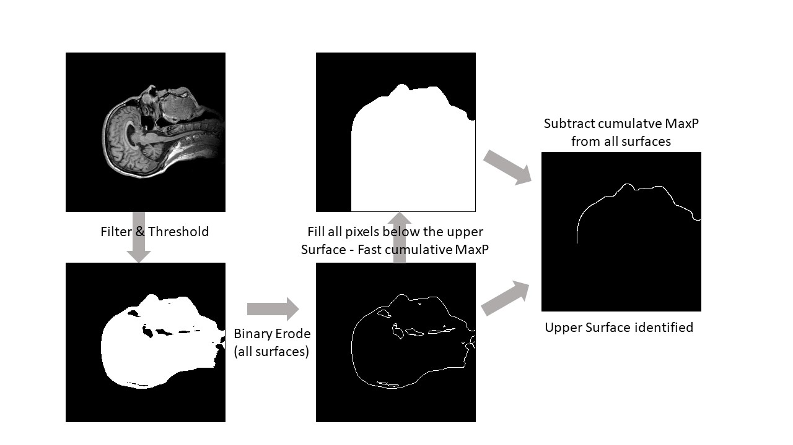
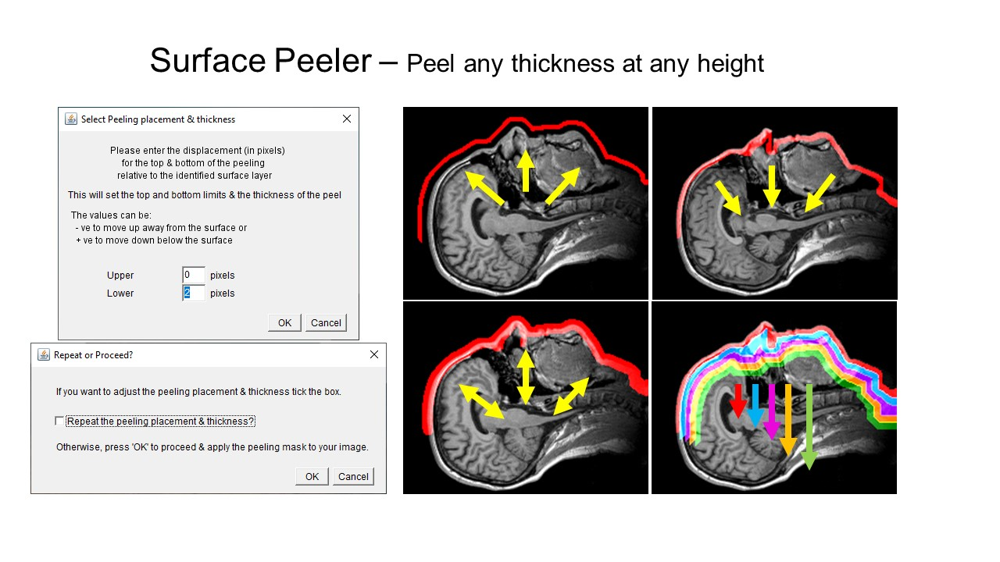
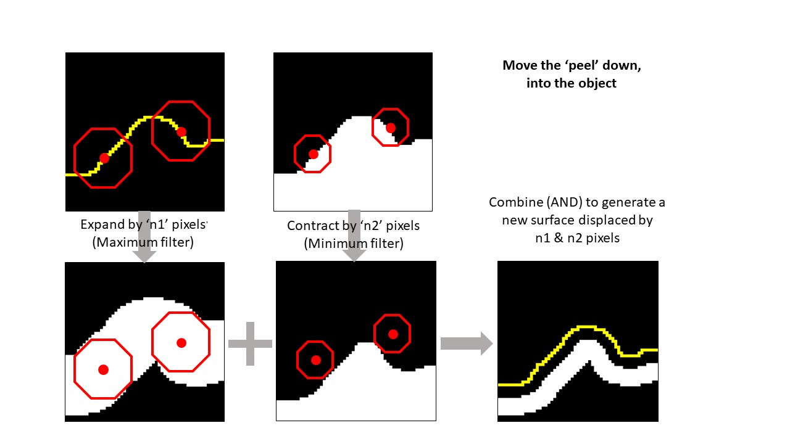
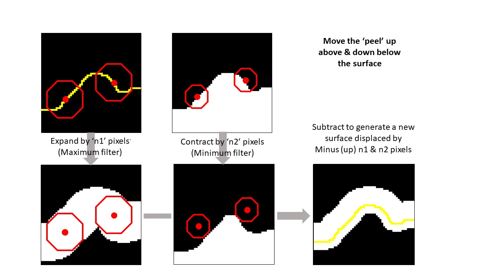
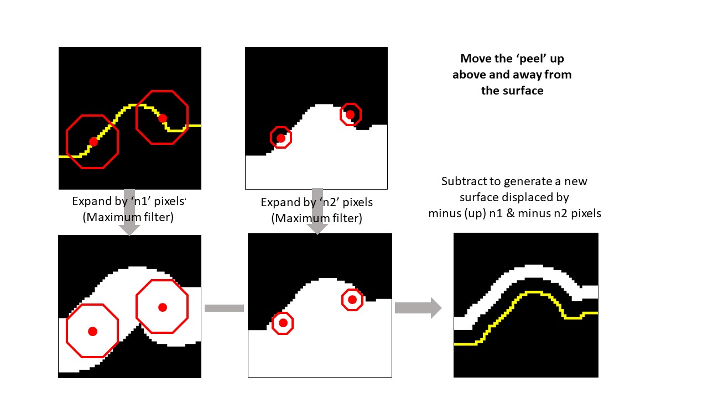
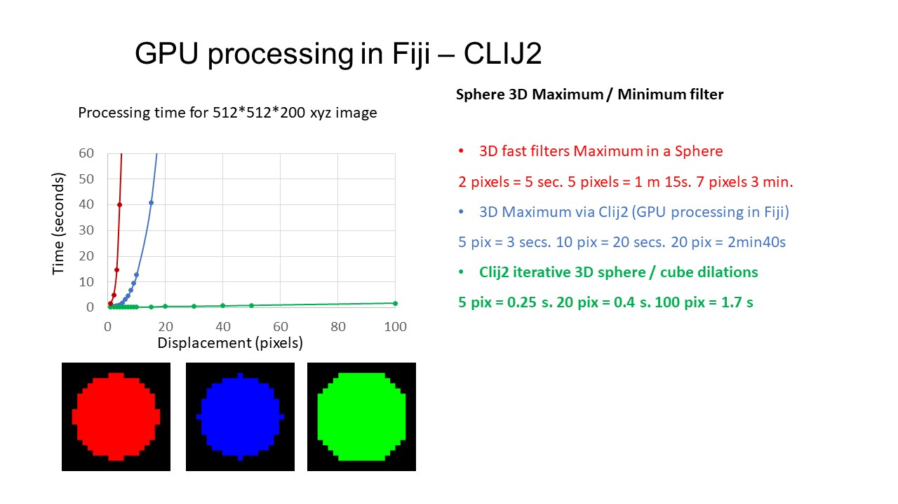

# SurfacePeeler
Version 2 of the macro to extract the surface layer of 3D volumetric images

[Link to SurfacePeeler Macro](https://githubusercontent.com/DaleMoulding/SurfacePeeler/main/SurfacePeelerCombined_v206.ijm)

This macro will take a single or multi channel image, and generate a mask following the upper surface of a 3D volumetric image.

The mask can be positioned any height above or below the upper surface & can be any number of pixels thick.

The mask moves up or down perpendicular to the surface following the local surface geometry.

Each step takes only a few seconds, so the whole process is easy to fine tune, and you are presented with previews of each step to decide whether to repeat or proceed.

It does this:

### Step 1 Threshold the image - choose a filter (Gaussian, Median etc) and threshold algorithm

### Step 2 Check the threshold gives an acceptable surface - if not change parameters to repeat

You can zoom in and scroll through the slices to check the threshold gives a good surface
Don't worry if it isn't perfect, you can move it up or down and set it any thickness later...

You are asked whether you want to repeat the step or proceed

### Step 3 Set the position of the surface layer to peel
-ve values are above the surface, 0 is the surface, +ve values go below the surface.

Here set at 0 to 4. (From the surface going 4 pixels into the sample)

All displacements are perpendicular to the surface, not just directly vertical.

You can set this any distance above the surface...  set it to start above the surface and go slightly below...

extract a thicker layer...

or any distance and thickness below the surface...

### Step 4 Select the image you want to apply the mask to & a 3D contour layer is peeled from your image

You are also left with the mask images (single pixel thick surface countour, filled solid image, your adjusted surface peel mask) so you can save / use these again if you wish.

### All steps and settings (filters, threshold, surface positioning & timings) and recorded

Thanks to Stephane Verger for making [SurfCut](https://github.com/sverger/SurfCut) freely available. SurfacePeeler macro uses an adaptation of the cumulative maximal projection from SurfCut to generate a solid volume of the input image. 

Thanks to [Robert Haase](https://github.com/haesleinhuepf) for help with implementing fast erosions and dilations using Clij2 via the [Image.sc forum](https://forum.image.sc/t/clij-3d-maxima-or-3d-dilate-multiple-iterations-as-a-loop/57496).

Thanks to [Gabe Galea](https://www.ucl.ac.uk/child-health/research/developmental-biology-and-cancer/developmental-biology-birth-defects/website-profiles/staff) for test images.

___

## How it works

#### Filter and threshold the input image, use a simple binary erode, fill all pixels below the top surface, subtract to generate a 3D contour tracing the surface
Fill all pixels below top surface uses a Cumulative Maximal Projection based on Stepane Verger's [SurfCut](https://github.com/sverger/SurfCut)

#### You can then adjust the thickness and placement of the 'peel' up or down to generate any thickness peel at any height perpendicalur to the surface

#### A combination of Maximum or Minimum Filters are used to move the 'peel'. Here it is moved down below the surface...

#### Here the upper bound of the peel is moved up above the surface, and the peel also expands below the surface...

#### Here the 'peel' is moved up away from the surface...

#### Maximum / Minimum filters are typically very slow. This macro uses the GPU and CLIJ2 to do it iteratively, 1 pixel at a time, using a sphere then a cube structuring element
This allows placement ofd the 'peel' at any position relative to the surface in seconds rather than minutes.

